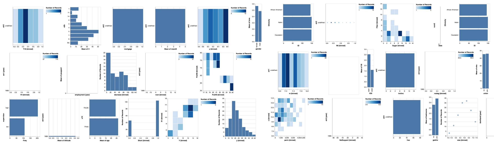
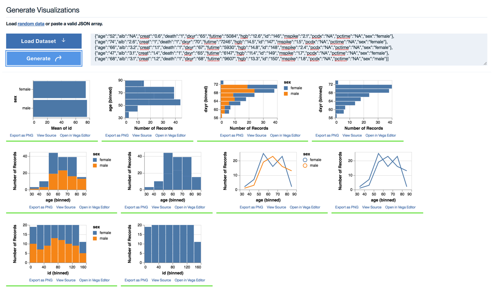

## Data2Vis: Automatic Generation of Data Visualizations Using Sequence-to-Sequence Recurrent Neural Networks.

> Experiments in generating visualizations using sequence to sequence models.

This repository contains source code used for experiments in the [Data2Vis](https://arxiv.org/abs/1804.03126) paper. Note that the code was tested with Python 3. Please python 3 as your test environment. The model also contains large files (vizmodel) saved with git-lfs, please install git-lfs and ensure you have the right filesize.

Slides: [Data2Vis Slides](https://docs.google.com/presentation/d/e/2PACX-1vSKaGElY3kNozGvIhINyIuwtsJ3AmBxhXtHQmRaQqasyGu5lw3YJxhCHSdRmq3UVAot_2c3F0NJC2Hg/pub?start=false&loop=false&delayms=10000)

Paper: [Data2Vis](https://arxiv.org/abs/1804.03126) paper

Demo: View [sample results here](http://hci.stanford.edu/~cagatay/data2vis/).

> The models in this repo were exported and tested using **Tensorflow version 1.10**. More recent verions might fail to load the saved models due to differences in ops specification. Please use **Tensorflow version 1.10** or earlier.  



Rapidly creating effective visualizations using expressive grammars is challenging for users who have limited time and limited skills in statistics and data visualization. Even high-level, dedicated visualization tools often require users to manually select among data attributes, decide which transformations to apply, and specify mappings between visual encoding variables and raw or transformed attributes. 
In this paper we introduce Data2Vis, a neural translation model for automatically generating visualizations from given datasets. We formulate visualization generation as a sequence to sequence translation problem where data specifications are mapped to visualization specifications in a declarative language (Vega-Lite). To this end, we train a multilayered attention-based recurrent neural network (RNN) with long short-term memory (LSTM) units on a corpus of visualization specifications. 
Qualitative results show that our model learns the vocabulary and syntax for a valid visualization specification, appropriate transformations (count, bins, mean) and how to use common data selection patterns that occur within data visualizations. Data2Vis generates visualizations that are comparable to manually-created visualizations in a fraction of the time, with potential to learn more complex visualization strategies at scale.


## Data Generation and Model


> Data2Vis is based on the code [seq2seq](https://github.com/google/seq2seq) code repository. The reader is highly encouraged to read the [seq2seq code documentation](https://google.github.io/seq2seq/) to learn more about training and inference are implemented. This repo only adds our [training data](examples), [data preparation scripts](utils), and a script to [serve](webserver.py) seq2seq inference results over a web api used in the [web demo](static).

Sequence to sequence models are trained using source and target pairs. In this experiment the source pair is a line of `json data` and target pair is a valid Vega-lite visualization specification for the `json data`. The [examples](code/examples) folder contains 4300 Vega-lite examples from which 215k pairs are generated ([sourcedata](code/sourcedata)) folder)and subsequently used to train a seq2seq model. 

For convenience we include a data generation [script](utils/data_gen.py) which is used to generate source, and target pairs from a folder containing Vega-lite visualization examples. Additional details on the content of the repo are given below.

| Folder | Content |
|----------|----------|
| [examples](examples)      | Directory containing 4300 Vega-lite example visualization specifications      |
| [examplesdata](examplesdata)     | Directory containing `json data` used in the visualization specifications above    | 
| [sourcedata](sourcedata)     | Directory containing `training data` (source, target pairs split into train/dev/test sets) used to train the seq2seq model. You can take a look at the [data_gen.py](utils/data_gen.py) script to see how the this training data is generated from the examples.| 
| [static](static)     | Directory containing web demo css and js files   | 
| [code/vizmodel](vizmodel)     | Directory containing the `trained model` generated in our training runs     | 

## Install Dependencies

The seq2seq code has a few dependencies that can be installed using the `requirement.txt` file

```bash
sudo pip3 install -r requirements.txt
```

## Training a Model

Following directions in the seq2seq repository, you can initiate a training run by first specifying your model configuration yaml file (s) and then using the train script in the [bin](bin) folder.

You can find several example configurations in the [example_configs](example_configs) folder.

```shell
python3 -m bin.train --config_paths="example_configs/nmt_bi.yml,example_configs/train_seq2seq.yml,example_configs/text_metrics_bpe.yml" 
```

Note: we used no delimiters to indicate we are training a character model.

```

```

## Inference

To run inference, use the infer script in the [bin](bin) folder. 

```bash
python3 -m bin.infer \
  --tasks "
    - class: DecodeText
      params:
        delimiter: '' " \
  --model_dir vizmodel \
  --model_params "
    inference.beam_search.beam_width: 2" \
  --input_pipeline "
    class: ParallelTextInputPipeline
    params:
      source_delimiter: ''
      target_delimiter: ''
      source_files:
        -  test.txt " 

``` 
Note: The above prints out an array containing predictions (array size = beam width).
`model_dir` is the directory containing trained model.
`source_files` is the path to a file containing text (data) to be translated.
`inference.beam_search.beam_width` sets the beam width used in beam search. 

Also note that the input text in `test.txt` must be in the transformed input format (ie. string, numeric and date column names are replaced with a short form).

```
{"num0": "0", "num1": "4", "num2": "80", "str0": "female"}
```

The  `forward_norm` method in the `utils/data_utils.py` file can be used to generate this normalized version of any data input. Alternatively, the user is encouraged to use the web demo interface.


## Web Demo.



For convenience, we provide a wrapper ([webserver.py](webserver.py)) that runs a web application with POST endpoints which return translations in JSON format.

Code for the [web demo](http://hci.stanford.edu/~cagatay/data2vis/) can be run with the following command.

```
python3 webserver.py
```


> Note that this demo uses a saved model from the vizmodel directory (187mb). The model is stored on Github using git-lfs. Please use git-lfs to clone the repository and ensure you have the entire 187mb saved model.

Also note that the parameters for the model are stored in the [vizmodel/train_options.json](vizmodel/train_options.json) folder. If you trained the model from scratch, add `the max_sequence_length` parameter and set it to a large value (e.g 2000) otherwise the model would generate a short sequence by default.

## Citing this work

The Data2Vis paper can be cited as follows:

```
@article{DBLP:journals/corr/abs-1804-03126,
  author    = {Victor Dibia and
               {\c{C}}agatay Demiralp},
  title     = {Data2Vis: Automatic Generation of Data Visualizations Using Sequence
               to Sequence Recurrent Neural Networks},
  journal   = {CoRR},
  volume    = {abs/1804.03126},
  year      = {2018},
  url       = {http://arxiv.org/abs/1804.03126},
  archivePrefix = {arXiv},
  eprint    = {1804.03126},
  timestamp = {Tue, 01 May 2018 19:46:29 +0200},
  biburl    = {https://dblp.org/rec/bib/journals/corr/abs-1804-03126},
  bibsource = {dblp computer science bibliography, https://dblp.org}
}
```


## Acknowledgement
This work was enabled by the contributions of many individuals. Thanks to the authors of the Vega-Lite,Voyager library and for sharing example data used for our experiments. Many thanks to the authors of the TensorFlow [seq2seq](https://github.com/google/seq2seq) model implementation and the TensorFlow library team — their work enabled us to learn about sequence models and rapidly prototype our experiments will little previous experience.

 
 
